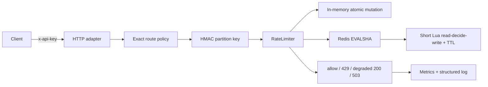

# System Design 04：Rate Limiter

[](https://github.com/estelledc/system-design-04-rate-limiter/actions/workflows/ci.yml)

这是一个可以运行、可以击穿边界、也敢于说明没证明什么的 Token Bucket 限流器。

它不是把教材架构图换成代码截图。核心目标是验证三件事：

1. 突发流量最多花掉桶容量，长期补充速率不被频繁请求或时钟回拨放大；
2. 多个服务实例通过 Redis 的单 key 原子脚本不能重复花同一份 token；
3. 存储故障、脚本缓存丢失和 HTTP 超限都产生可区分、可观察的结果。

## 已实现

- 多条静态策略按 `method + path` 精确匹配；当前示例包含普通与高成本接口。
- 整数定点 Token Bucket：保留毫秒级不足一个 token 的补充额度，不使用会累积漂移的浮点 token。
- 可控时钟的内存存储，用于本地运行和确定性边界测试。
- Redis 7.4 适配器：短 Lua 脚本原子执行读、补充、判定、扣减和 TTL。
- Redis 服务端 `TIME`，不接受客户端自报时间；`EVALSHA` 缓存丢失后单航班重载。
- HMAC-SHA256 分区键，Redis、日志和指标都不保存原始 `x-api-key`。
- 明确的 fail-open / fail-closed 策略。存储不可用不是“配额已耗尽”：fail-closed 返回 `503`，而不是 `429`。
- RFC 6585 的 `429 Too Many Requests`、整数秒 `Retry-After` 与 `Cache-Control: no-store`。
- liveness、readiness、Prometheus 文本指标、低基数结构化日志和优雅退出。
- Node 22 / 24 / 26 与真实 Redis 7.4 的 GitHub Actions 集成门禁。

## 先运行本地竖切

要求 Node.js 22 或更高版本。

```bash
npm ci --ignore-scripts
npm run check
npm start
```

默认监听 `127.0.0.1:8080`，使用单进程内存存储。另开终端：

```bash
for i in {1..12}; do
  curl -i -sS \
    -H 'x-api-key: local-demo-key' \
    http://127.0.0.1:8080/v1/resource \
    | sed -n '1,8p'
done
```

`standard` 策略初始容量为 10，每秒补充 5 个 token。第 11 个紧邻请求会返回类似：

```http
HTTP/1.1 429 Too Many Requests
Retry-After: 1
Cache-Control: no-store
Content-Type: application/json; charset=utf-8

{"error":"rate_limited","policy":"standard","retry_after_seconds":1}
```

健康与指标入口：

```bash
curl -sS http://127.0.0.1:8080/health/live
curl -sS http://127.0.0.1:8080/health/ready
curl -sS http://127.0.0.1:8080/metrics
```

## Redis 模式

Redis 模式要求已运行的 Redis 7.x，以及至少 32 字节的独立 HMAC secret：

```bash
STORE_BACKEND=redis \
REDIS_URL=redis://127.0.0.1:6379 \
PARTITION_HMAC_SECRET='replace-with-a-secret-from-a-secret-manager' \
npm start
```

仓库不提供默认凭证，也不会把 URL 或原始 key 写进日志。真实部署应从 secret manager 注入 secret，并给 Redis 使用最小 ACL、TLS 与受限网络。若 Redis 在进程启动前不可连接，进程启动失败；运行中依赖故障才进入各策略的 fail-open / fail-closed 分支。

## 业务合同

### 目标

- 服务端按稳定主体和路由执行请求配额；
- 允许有限突发，同时限制长期平均请求速率；
- 多实例不能因并发读改写而超卖 token；
- 超限方知道何时可重试，运维方知道系统在限流还是降级。

### 非目标

- `x-api-key` 不是认证。攻击者能无限创建新身份时，任何 per-key 限流都会被 Sybil 绕过；
- 当前不同时扣减“租户 + 用户 + 全局”多个层级。Redis Cluster 跨 slot 原子性需要单独设计；
- 不做动态配置分发、管理后台、跨区域强一致配额或付费计费；
- 内存模式不是分布式限流，也不能在进程重启后保留配额；
- 本仓的基准数字不是 Redis 容量、生产 SLA 或 DDoS 防护证明。

## 数量级估算

下面只是设计输入，不是实测结论。假设入口峰值为 100,000 请求/秒，每个请求做一次同步限流判定：

| 项 | 估算 | 含义 |
|---|---:|---|
| 判定调用 | 100,000 次/秒 | Redis 路径至少承受同量级脚本调用，不能用单机开发结果外推 |
| 每日判定 | 86.4 亿次 | 说明限流器位于极热路径，日志不能逐请求写高基数身份 |
| 假设单次往返 | 500 B | 仅 Redis 协议与字段的粗略假设，不含 TLS / TCP 开销 |
| 假设网络量 | 约 50 MB/s 单向量级 | 用来暴露网络也是瓶颈，不是采购依据 |
| 状态规模 | `O(active partitions)` | 每个活跃分区一个带 TTL 的 hash；实际字节取决于 Redis 版本与编码，需实测 |
| 限流延迟预算 | P99 不超过 5 ms | 设计目标；当前尚无生产网络、分片与故障注入证明 |

如果真实流量接近这个假设，下一步不是“把 Redis 机器变大”，而是先用真实 key 分布做压测，检查热点、连接池、slot 分布、脚本耗时、网络与故障域，再决定分片或分层限流。

## 核心不变量

配置使用 `capacity`、`refillTokens`、`refillIntervalMs` 和 `cost`。实现把余额保存为整数单位：

```text
capacity_units = capacity * refillIntervalMs
cost_units     = cost * refillIntervalMs
refill_units   = elapsedMs * refillTokens
```

每次判定必须满足：

```text
0 <= balance_units <= capacity_units
allowed  => old_refilled_balance >= cost_units
denied   => balance_units is unchanged by consumption
retry_ms = ceil((cost_units - balance_units) / refillTokens)
```

这种表示能保留“1 token / 2000 ms”在每毫秒积累的额度。若每个被拒请求都把 `last_refill` 改成当前时间、却丢掉不足一个 token 的小数，持续高频请求反而可能永远得不到补充；测试专门覆盖了这个反例。

## 最小调用链



更完整的状态、故障与部署边界见 [架构说明](docs/architecture.md)。

## HTTP 语义为什么这样选

- 超过配额返回 `429`；响应体说明策略，`Retry-After` 给出整数秒等待时间。
- Redis 不可用且 fail-closed 返回 `503`。这表示“依赖不可用，无法判定”，不冒充“用户真的用完了额度”。
- 所有业务响应使用 `no-store`，避免缓存过期的个体判定。
- 本版不发送 `RateLimit` / `RateLimit-Policy`。截至 2026-05-23，它们仍是 `draft-ietf-httpapi-ratelimit-headers-11`，不是已发布 RFC；若后续采用，必须固定草案版本并标成实验字段。
- `X-RateLimit-*` 存在多种冲突语义，本版也不自造兼容承诺。

## 故障矩阵

| 观察 | 策略 | 对外结果 | 证据 |
|---|---|---|---|
| token 足够 | 任意 | `200` | 单元 + HTTP 测试 |
| token 不足 | 任意 | `429` + `Retry-After` | 单元 + HTTP 测试 |
| Redis script cache 丢失 | 任意 | 同一请求重载后再执行一次 | fake 并发测试 + Redis 集成测试 |
| 存储运行中失败 | fail-open | `200`, `degraded=true` | 故障策略 + HTTP 测试 |
| 存储运行中失败 | fail-closed | `503` + `Retry-After: 1` | 故障策略 + HTTP 测试 |
| 内存时钟回拨 | 任意 | 不新增 token | 可控时钟测试 |
| 空闲分区 | 任意 | TTL 后删除；删除时间不早于完整补满时间 | 内存 + Redis TTL 测试 |

## 验证

```bash
npm run lint
npm test
npm run benchmark
npm audit --audit-level=high
```

本地没有 Redis 时，集成用例会明确显示 `SKIP`。GitHub Actions 为每个 Node 版本启动真实 Redis 7.4，并设置 `REDIS_URL` 使同一用例变成必跑。

基准输出包含 runtime、平台、架构、迭代数和原始耗时。它只测单进程同一热键的内存决策循环，不设置脆弱的 QPS 阈值，也不把结果外推到 HTTP、Redis、跨机网络或生产流量。

详细证据和未知项见 [验证边界](docs/verification.md)。

## 目录

```text
config/policies.json       多策略源真相
src/policy.js              配置与安全数值边界
src/stores/                内存实现、Redis 适配器与 Lua 原子脚本
src/rate-limiter.js        分区键、判定和故障策略
src/server.js              HTTP、健康、指标与日志适配
test/                      单元、HTTP 和真实 Redis 集成测试
scripts/benchmark.mjs      环境绑定的本地基准收据
docs/                      架构、ADR、威胁模型和验证边界
```

## 来源与 clean-room 边界

- 题型入口：[liquidslr/system-design-notes Chapter 4](https://github.com/liquidslr/system-design-notes/blob/9d8388721e7231442763ad37398b8d82224aa68f/04.%20Rate%20Limiter/Readme.md)。该固定 tree 没有 LICENSE，本仓不复制其文字、图片或代码。
- 分布式机制：[Redis rate limiter](https://redis.io/docs/latest/develop/use-cases/rate-limiter/)与[Redis programmability](https://redis.io/docs/latest/develop/programmability/)。Redis 官方确认 Lua 的 read-decide-update 原子性，也明确脚本会阻塞服务器且缓存可丢失。
- HTTP：[RFC 6585 §4](https://www.rfc-editor.org/rfc/rfc6585.html#section-4)与[RFC 9110 Retry-After](https://www.rfc-editor.org/rfc/rfc9110.html#name-retry-after)。
- 仍在变化的候选规范：[RateLimit header fields draft-11](https://datatracker.ietf.org/doc/draft-ietf-httpapi-ratelimit-headers/11/)。

所有源码、测试、图和文档均为独立实现。来源用于核对问题、机制和标准边界，不是复制模板。

## License

[MIT](LICENSE)
