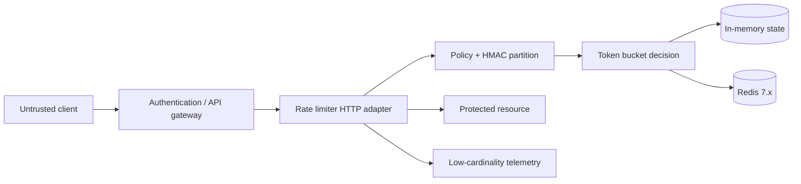
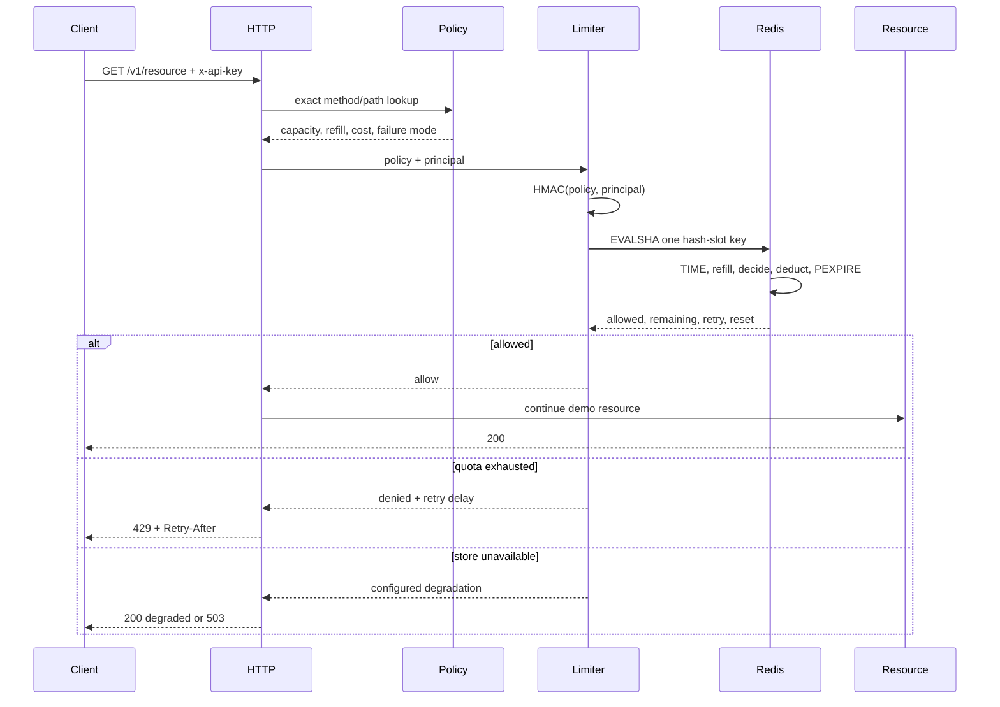

# Architecture

## 1. Context

The limiter runs on the synchronous request path between a trusted identity
boundary and a protected resource. Authentication must happen before this
component. The presented `x-api-key` is a stable quota partition input, not an
authorization decision.



Only one store backend is active in a process. The memory backend is a local
reference and development mode. The Redis backend is the distributed path.

## 2. Request sequence



The repository's HTTP vertical slice returns the protected response directly;
in a gateway integration, the `Resource` step would call the actual upstream.

## 3. State and arithmetic

For a policy with capacity `C`, refill amount `R`, interval `I` milliseconds,
and request cost `K`, the store persists:

```text
balance_units
last_refill_ms
```

One token is represented by `I` integer units:

```text
max_balance  = C * I
refill       = min(elapsed_ms, ceil(max_balance / R)) * R
request_cost = K * I
```

The elapsed time is clamped to the time needed to fill the bucket. This both
caps arithmetic and avoids overflow after a large clock jump. Policy validation
keeps `C * I` inside JavaScript's safe integer range; the configured maxima also
stay below Lua's exact integer range for the operations used here.

The store must preserve these invariants after every call:

```text
0 <= balance_units <= max_balance
allowed => balance_units_before_consume >= request_cost
denied  => no request_cost is deducted
```

## 4. Atomicity boundary

### In-memory

An `async consume()` call performs no `await` before completing its map
mutation. JavaScript therefore runs one whole read-refill-decide-write section
in a single event-loop turn. This is atomic only inside one process.

### Redis

The Lua script touches one declared key. Redis executes the script atomically,
so concurrent service instances cannot observe and spend the same old balance.
The key format is:

```text
rate-limiter:{hmac-sha256-partition}:policy-id
```

The braces make the policy-scoped HMAC partition the explicit Redis Cluster
hash tag. Because the HMAC input includes the policy ID, different policies are
not promised to share a slot. This repository changes one key per decision; it
does not claim atomic hierarchical quotas across policies, principals, or
regions.

Redis `TIME` is read inside the script. Redis 7 uses effect-based script
replication, allowing the resulting writes to replicate without trusting every
application host's wall clock. The script is intentionally constant-time and
small because Redis blocks other server work while it executes.

## 5. Script lifecycle

The application loads the script and calls it by SHA. A restart, failover, or
`SCRIPT FLUSH` can remove that cache. On `NOSCRIPT`:

1. only a request that failed on the current SHA clears it;
2. concurrent requests share one `SCRIPT LOAD` promise;
3. each affected request retries evaluation once;
4. any second failure escapes to the configured dependency-failure policy.

This is a bounded recovery, not an unbounded retry loop.

## 6. TTL and memory lifecycle

Every successful script evaluation refreshes key TTL. Policy validation rejects
an idle TTL shorter than the time needed to refill an empty bucket. Otherwise,
expiration could delete a partially empty bucket and recreate it full earlier
than the configured rate permits.

The in-memory store performs lazy expiry and a bounded sweep every 256
operations. Redis owns key cleanup through `PEXPIRE`. Actual Redis bytes per key
depend on version, allocator, and hash encoding and are deliberately not guessed.

## 7. Failure semantics

| Failure | fail-open | fail-closed |
|---|---|---|
| quota exhausted | `429` | `429` |
| store command fails | allow with `degraded=true` | `503`, retry later |
| malformed store reply | allow with `degraded=true` | `503`, retry later |
| readiness ping fails | `/health/ready` returns `503` | same |
| Redis unavailable before startup | process fails startup | same |

Fail-open favors protected-resource availability and risks overload or quota
abuse. Fail-closed protects downstream capacity and risks rejecting legitimate
traffic. The choice belongs to each route policy, not a hidden global fallback.

## 8. Multi-region boundary

No cross-region correctness claim is made. A single authoritative Redis region
adds WAN latency; independent regional buckets allow a client to spend each
region's burst; asynchronous replication cannot provide a strict global token
invariant during partitions. A real design must choose one of those semantics
from product requirements before adding topology.

## 9. Observability

- request logs contain request ID, validated policy ID, status, outcome,
  duration, and a 12-character HMAC fingerprint;
- metrics use policy, outcome, route label, and status only;
- arbitrary URL paths collapse to `unmatched`, preventing metric-cardinality
  attacks;
- raw API keys, Redis URLs, HMAC secrets, and query strings are absent.

Candidate alerts and response steps are in [operations.md](operations.md).
